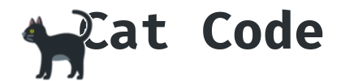

<div align='center'>

  
[Início](README.md)

## ◈ Como instalar
Rode os seguintes comandos no seu terminal linux:

<div align='left'>

  ```shell
    $ cd cat-code
    $ chmod +x ./mach.sh
    $ ./make.sh
  ```
</div>
<br/>

## ◈ Como usar
Agora apenas rode o comando:

<div align='left'>

  ```sh
    catc file.yml # ...arquivos
  ```
</div>

Se você quiser ler um arquivo com outra syntax:
<div align='left'>

  ```sh
    catc file.yml:json # arquivo:syntax
  ```
</div>
<br/>

## ◈ Como criar sua propria highlight
Na pasta /langs é onde ficam os arquivos de configuração  
de cada linguagem, todos tem a extenssão .yml.

Seu padrão deve ser:

<div align='left'>

  ```yml
    colors: # opcional
      # suas variaveis de cor
      red: 31
      blue: 34

    regexes:
      - color: 'red'      # chamando uma variavel de cor
        regex:            # isso pode ser uma lista ou não
          - '\bfalse'
          - '\btrue'

      - color: 34         # cor azul (não chama uma variavel)
        regex: '[a-zA-Z]'
  ```
</div>

Se a sua linguagem tem mais de uma extenssão, no arquivo  
extensions.yml ponha isso:

<div align='left'>

  ```yml
    # "extensão": "nome do arquivo .yml criado em /langs"
    # OBS: não é necessário o nome do arquivo.
    c: cpp
    h: cpp
  ```
</div>
</div>